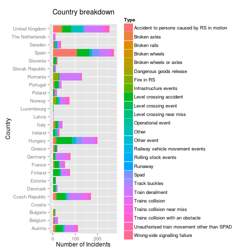

## Explore European Railway Incident Data
### Visualization of incident data from the European Railway Agency

### **Agenda**
#### Motivation
#### Methodology
#### Result
#### Try the [Live shiny app](http://geltmar.shinyapps.io/spielwiese)
<footer class = 'logo'>
</img>
</footer>

--- .class #id 

### Motivation
* Since 2006 the European Railway Agency ([ERA](http://www.era.europa.eu)) is collecting railway incident data
* The data is used to define Common Safety Targets ([CST](http://www.era.europa.eu/Core-Activities/Safety/Safety-Performance/Pages/Common-Safety-Targets.aspx))
* **But:** The data from the 26 member states (with railways) is very inconsistent
* **So:** To explore the inconsistencies a shiny app was developed for the coursera class [Developing Data Products](https://class.coursera.org/devdataprod-002)

<footer class = 'logo'>
</img>
</footer>

---

### Methodology
* Development of an R shiny app
* Make countries selectable
* Make incident types selectable
* Allow to set time span for data

<footer class = 'logo'>
</img>
</footer>

---

### Result
* Output graphics are done with ggplot2 like this

```r
p <- ggplot(data = rail, aes(x = Country, fill = factor(Occurrence.type))) + 
    geom_bar(stat = "bin") + coord_flip() + guides(fill = guide_legend(title = "Type")) + 
    labs(title = "Country breakdown\n") + ylab("Number of Incidents") + xlab("Country")
```

<footer class = 'logo'>
</img>
</footer>

---

### Result
 


